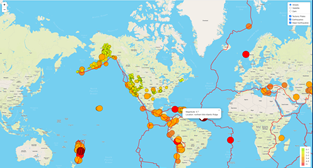
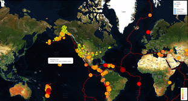
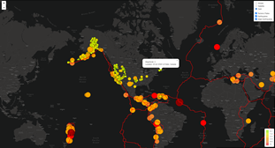

# Mapping Earthquakes and Tectonic Plates  

## Using JavaScript, Leaflet.js, and geoJSON data, a interactive features delivers three map styles and three data overlays.  Each map style interacts with one or all of the data overlays.  

### Data Sources:
- All Earthquakes:  https://earthquake.usgs.gov/earthquakes/feed/v1.0/summary/all_week.geojson
- Major Earthquakes of magnitude >4.5: https://earthquake.usgs.gov/earthquakes/feed/v1.0/summary/4.5_week.geojson
- Tectonic Plates: https://raw.githubusercontent.com/fraxen/tectonicplates/master/GeoJSON/PB2002_boundaries.json

### Mapping Earthquakes - Streets Map:

  
### Mapping Earthquakes - Satellite Map:

### Mapping Earthquakes - Dark Map:

